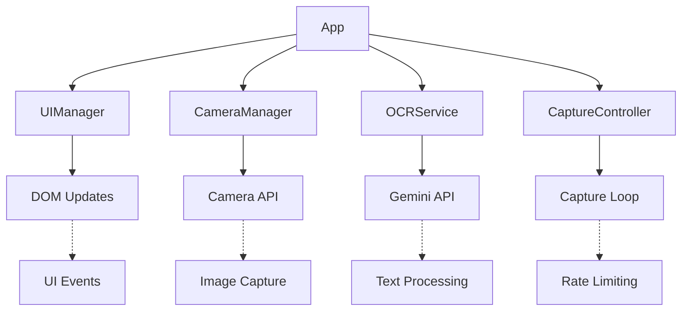
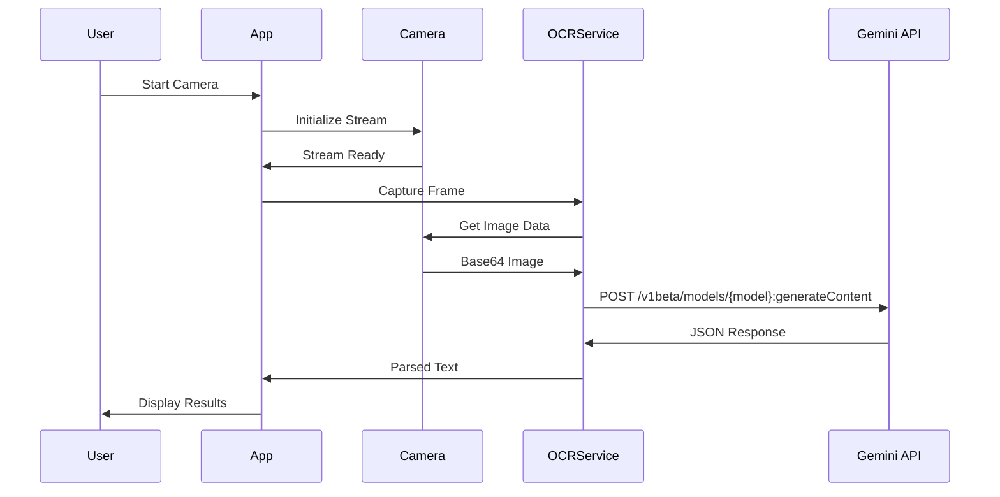

# Webcam OCR - Real-time Text Recognition

A modern, modular webcam OCR application using Google's Gemini 2.5 Flash models for real-time text extraction from camera feeds. Built with vanilla HTML/CSS/JavaScript and designed for maintainability and extensibility.

## 🏗️ Architecture Overview

This application follows a clean, modular architecture with clear separation of concerns:



### Core Components

- **UIManager**: Handles DOM interactions, UI state management, and user feedback
- **CameraManager**: Manages camera lifecycle, permissions, and image capture
- **OCRService**: Handles Gemini API integration, request building, and response parsing
- **CaptureController**: Orchestrates capture loops with throttling and error handling
- **App**: Main coordinator that wires all components together

## ✨ Key Features

### 🚀 Performance & Reliability
- **Dual Capture Modes**: Interval (1s polling) vs Async (continuous processing)
- **Intelligent Rate Limiting**: Automatic retry with exponential backoff
- **Concurrent Request Handling**: Multiple API calls can be in-flight simultaneously
- **Confidence Scoring**: Heuristic-based confidence calculation for OCR results
- **Text Filtering**: Automatic cleaning of unwanted patterns and artifacts

### 🤖 AI Integration
- **Gemini 2.5 Flash Models**: Choice between Lite (fast) and Flash (powerful) variants
- **Optimized Prompts**: Carefully crafted prompts for text-only extraction
- **Response Validation**: Robust parsing with fallback handling
- **Error Recovery**: Graceful handling of API failures and rate limits

### 📱 User Experience
- **Auto-start**: Camera and OCR begin automatically when page loads
- **Mobile Responsive**: Optimized for both desktop and mobile devices
- **Real-time Feedback**: Live status updates and processing indicators
- **Debug Panel**: Development debugging information (localhost only)
- **Keyboard Shortcuts**: ESC to stop camera, visual feedback

### 🔧 Developer Experience
- **Modular Architecture**: Clean separation of concerns, easy to extend
- **Configuration-driven**: All settings externalized in `gemini-config.js`
- **Error Boundaries**: Comprehensive error handling and user feedback
- **Performance Monitoring**: Built-in debugging and performance insights

## 🚀 Quick Start

### Prerequisites
- Modern web browser (Chrome 88+, Firefox 85+, Safari 14+, Edge 88+)
- Local web server (recommended for camera access)
- Gemini API key from [Google AI Studio](https://aistudio.google.com/)

### Installation & Setup

1. **Clone or download** this repository to your local machine

2. **Get your Gemini API key** from [Google AI Studio](https://aistudio.google.com/)

3. **Configure API key** (choose one method):
   - **Environment variable**: `export GEMINI_API_KEY="your-api-key-here"`
   - **Browser console**: Open developer tools and run `GEMINI_API_KEY = "your-api-key-here"`
   - **Prompt**: The app will ask for your API key on first use

4. **Start a local web server** in the project directory:
   ```bash
   # Using Python 3
   python -m http.server 8000

   # Using PHP
   php -S localhost:8000

   # Using Node.js
   npx serve .
   ```

5. **Open your browser** and navigate to `http://localhost:8000`

6. **Grant camera permissions** when prompted

7. **OCR begins automatically** - results appear in real-time

## 📁 Project Structure

```
webcam-ocr/
├── index.html          # Main application interface
├── styles.css          # Modern responsive styling
├── script.js           # Core application logic (637 lines)
├── gemini-config.js    # AI model configuration & prompts
├── README.md           # This documentation
└── .gitattributes      # Git configuration
```

## ⚙️ Configuration

### Model Configuration

The application supports two Gemini 2.5 Flash models, configured in `gemini-config.js`:

```javascript
models: {
  'gemini-2.5-flash-lite': {
    name: 'gemini-2.5-flash-lite',
    displayName: 'Gemini 2.5 Flash Lite (Fast)',
    temperature: 0,
    maxOutputTokens: 1024,
    topP: 0.8,
    topK: 40,
    apiEndpoint: 'generateContent',
    supportsStreaming: false,
    description: 'Fast model optimized for speed and efficiency',
    thinkingConfig: {
      thinkingBudget: 5
  },
  'gemini-2.5-flash': {
    name: 'gemini-2.5-flash',
    displayName: 'Gemini 2.5 Flash',
    temperature: 0,
    maxOutputTokens: 1024,
    topP: 0.8,
    topK: 40,
    apiEndpoint: 'generateContent',
    supportsStreaming: false,
    description: 'A slightly more powerful flash model.',
    thinkingConfig: {
      thinkingBudget: 512
    }
  }
}
```

### OCR Prompts

The system uses carefully crafted prompts for optimal text extraction:

```javascript
prompts: {
  textOnly: [
    'You are an OCR text extractor. Extract ONLY the visible text from the image.',
    'Respond with TEXT ONLY: no JSON, no markdown, no code fences, no explanations.',
    'Do NOT describe the image, do NOT identify objects, do NOT analyze content.',
    'Rules:',
    '- Preserve characters exactly as they appear; do not translate.',
    '- Normalize multiple spaces to single; keep original line breaks using real newline characters.',
    '- Do not invent or add any text that is not actually visible.',
    '- Ignore drawings, illustrations, and non-text elements.',
    '- If any character is uncertain or ambiguous, OMIT it; never guess or fabricate.',
    '- If the image is blurred, low-resolution, over-exposed, under-exposed, out-of-focus, or otherwise unreadable: respond EXACTLY with: no text detect and image blur',
    '- If nothing is readable after omitting uncertain parts: respond EXACTLY with: no text detect and image blur'
  ].join('\n')
}
```

### Rate Limiting

Configurable retry and backoff behavior:

```javascript
rateLimit: {
  retryDelay: 5000,        // Base delay between retries (ms)
  maxRetries: 1,           // Maximum retry attempts
  backoffMultiplier: 1.5   // Exponential backoff multiplier
}
```

## 🔧 Development Guide

### Architecture Deep Dive

#### Component Responsibilities

**UIManager** (`script.js:42-183`)
- DOM element references and caching
- UI state management and updates
- Status indicators and user feedback
- Result display and management
- Debug information panel

**CameraManager** (`script.js:186-260`)
- Camera permission handling
- Video stream lifecycle management
- Image capture and canvas operations
- Mobile optimization (resolution, frame rate)

**OCRService** (`script.js:263-376`)
- Gemini API request building
- Response parsing and validation
- Error handling and retry logic
- Model selection and configuration

**CaptureController** (`script.js:379-479`)
- Capture loop orchestration
- Throttling and rate limiting
- Text filtering and cleaning
- Confidence calculation

**App** (`script.js:482-637`)
- Component initialization and wiring
- Event binding and coordination
- Auto-start logic
- Global error handling

### Extending the Application

#### Adding New AI Models

1. **Update configuration** in `gemini-config.js`:
```javascript
'custom-model': {
  name: 'custom-model',
  displayName: 'Custom Model',
  temperature: 0.1,
  maxOutputTokens: 2048,
  apiEndpoint: 'generateContent',
  description: 'Your custom model description'
}
```

2. **Add model-specific prompts** if needed:
```javascript
prompts: {
  customModelPrompt: 'Your custom prompt here...'
}
```

#### Custom Text Processing

Extend the `cleanOcrResult` method in the App class:

```javascript
cleanOcrResult(text) {
  // Add your custom cleaning logic here
  const customPatterns = [
    /your-pattern/g,
    /another-pattern/i
  ];

  let cleaned = text;
  customPatterns.forEach(pattern => {
    cleaned = cleaned.replace(pattern, '');
  });

  return cleaned;
}
```

#### UI Customization

The application uses CSS custom properties for easy theming:

```css
:root {
  --primary: #007aff;      /* Primary brand color */
  --surface: #ffffff;       /* Card backgrounds */
  --background: #f0f2f5;    /* Page background */
  --text: #1c1c1e;         /* Primary text */
  --success: #34c759;      /* Success states */
  --error: #ff3b30;        /* Error states */
  --warning: #ff9500;      /* Warning states */
}
```

### Debugging

#### Development Mode

The debug panel is automatically enabled on localhost:

```javascript
// Access the main app instance
window.webcamOCR

// Available methods
webcamOCR.camera.start()      // Start camera manually
webcamOCR.capture.start()     // Start OCR capture
webcamOCR.ui.clearResults()   // Clear results
webcamOCR.ocr.request(base64) // Test OCR with image
```

#### Debug Information

The debug panel shows:
- Browser and HTTPS status
- Camera API availability
- Stream status and video dimensions
- Real-time performance metrics

### Performance Optimization

#### Memory Management
- Automatic cleanup of video streams
- Canvas reuse to minimize allocations
- Result list limited to 15 items
- Event listener cleanup on page unload

#### Network Optimization
- Image quality optimization (80% JPEG)
- Request deduplication
- Intelligent retry strategies
- Connection pooling awareness

## 📊 API Integration Details

### Gemini API Usage

The application integrates directly with Google's Generative Language API:



### Request Structure

```javascript
{
  contents: [{
    role: 'user',
    parts: [
      { text: 'OCR prompt text...' },
      { inline_data: { mime_type: 'image/jpeg', data: 'base64...' } }
    ]
  }],
  generationConfig: {
    temperature: 0,
    maxOutputTokens: 1024,
    topP: 0.8,
    topK: 40
  }
}
```

### Response Processing

The application handles multiple response formats:
- Plain text responses
- JSON responses with text fields
- Error responses with retry logic
- Rate limit responses (429) with backoff

## 🔒 Security Considerations

- **Camera Permissions**: Requires explicit user consent
- **API Key Management**: Multiple secure storage options
- **CORS Compliance**: Proper cross-origin request handling
- **Input Validation**: Sanitization of all user inputs
- **Error Handling**: No sensitive data exposure in errors

## 🛠️ Troubleshooting

### Common Issues

**Camera Access Denied**
- Check browser permissions in settings
- Ensure HTTPS (required for camera access)
- Try refreshing and re-granting permissions

**OCR Processing Fails**
- Verify API key is set correctly
- Check browser console for detailed errors
- Ensure stable internet connection
- Try switching between AI models

**Performance Issues**
- Close other applications using camera
- Check internet connection stability
- Consider using the faster Gemini 2.5 Flash Lite model
- Monitor debug panel for performance metrics

### Debug Commands

```javascript
// Check camera status
webcamOCR.camera.isActive()

// Test OCR with mock data
webcamOCR.capture.captureOnce()

// View current configuration
webcamOCR.ocr.getModel()

// Check rate limiting status
webcamOCR.capture.throttleUntil
```

## 🤝 Contributing

### Development Setup
1. Fork the repository
2. Create a feature branch
3. Make changes with comprehensive error handling
4. Test on multiple browsers and devices
5. Update documentation for any new features
6. Submit a pull request

### Code Style
- Use meaningful variable names
- Add comments for complex logic
- Follow the existing modular pattern
- Include error handling for all operations
- Test edge cases and error scenarios

## 📈 Performance Benchmarks

### Typical Performance
- **Startup Time**: ~2-3 seconds (camera initialization)
- **OCR Processing**: 1-3 seconds per frame (varies by model)
- **Memory Usage**: ~50-100MB during operation
- **Network Usage**: ~100-500KB per OCR request

### Optimization Tips
- Use Gemini 2.5 Flash Lite for faster processing
- Enable async capture mode for better responsiveness
- Monitor rate limits to avoid throttling
- Consider image preprocessing for better OCR accuracy

## 📄 License

This project is open source and available under the MIT License.

## 🙏 Acknowledgments

- **Google Gemini**: Advanced multimodal AI models
- **Modern Web APIs**: Camera, Canvas, and Fetch APIs
- **Open Source Community**: For continuous inspiration and tools

---

**Ready to extract text from your camera feed? The application starts automatically and provides real-time OCR processing with intelligent error handling and performance optimization.**